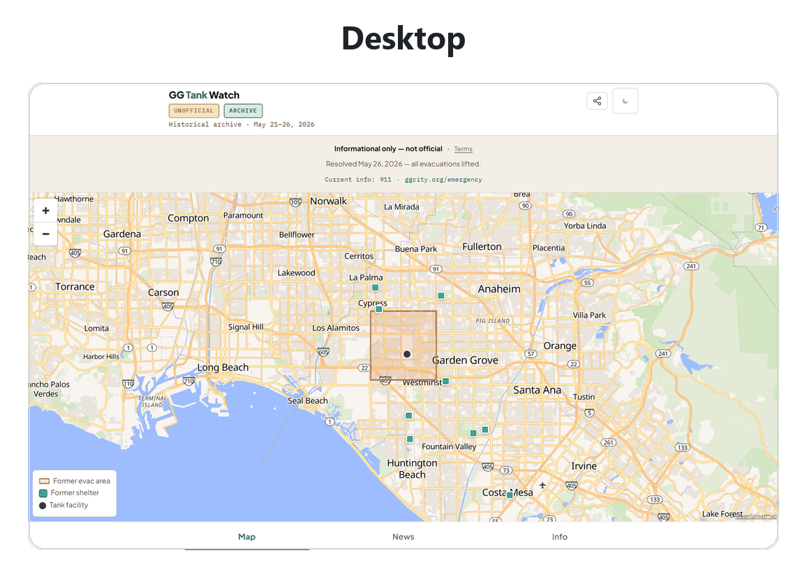
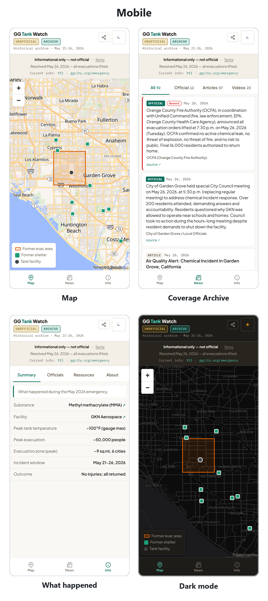

# GG Tank Watch

**A frozen historical archive of the May 21–26, 2026 Garden Grove methyl-methacrylate (MMA) chemical-tank emergency.**

- A real Orange County, California incident: ~50,000 residents evacuated from ~9 square miles across six cities.
- Built during the emergency by a local volunteer to amplify official information for evacuees.
- **No longer updated.**

[](#)
[](LICENSE)
[](#stack)
[](eval/)
[](https://github.com/Mike-E-Log/gg-tank-watch/actions/workflows/eval.yml)
[](https://ggtankwatch.org)

> **Informational only. Not official emergency guidance.** The incident resolved **May 26, 2026**. For any current emergency, call **911** and see **[ggcity.org/emergency](https://ggcity.org/emergency)**.
>
> *Independent and not affiliated with, endorsed by, or operated by the City of Garden Grove, the Orange County Fire Authority, Cal OES, the EPA, or any government agency.*

**TL;DR:** A single-page emergency dashboard built for a real ~50,000-person chemical evacuation, now a frozen archive. It only relays official information and routes people to officials; it issues no directives of its own, and that no-instructions guarantee is enforced in **code and tests, not prompting**. Stack: vanilla JS + Python stdlib, zero dependencies. Proof: `python eval/run_all.py --skip integration` runs 211/211.

<p align="center">
  <a href="https://ggtankwatch.org"></a>
</p>

<p align="center">
  <a href="https://ggtankwatch.org"></a>
</p>

<p align="center">
  <sub>Built by <a href="https://github.com/Mike-E-Log"><b>Mike Ilog</b></a> · AI Engineer · LLM &amp; agent evaluation &nbsp;·&nbsp; <a href="https://www.linkedin.com/in/mikeilog/">LinkedIn</a></sub>
</p>

## Contents

- [What this demonstrates](#what-this-demonstrates)
- [What this is, in 30 seconds](#what-this-is-in-30-seconds)
- [Origin](#origin)
- [Safety architecture & verification](#safety-architecture--verification)
- [The thesis: a conduit, not a judge](#the-thesis-a-conduit-not-a-judge)
- [Safety & ethics decisions (the core)](#safety--ethics-decisions-the-core)
- [How it was built: the journey, and the reversals](#how-it-was-built-the-journey-and-the-reversals)
- [The Coverage Archive (News tab)](#the-coverage-archive-news-tab)
- [The close-out audit](#the-close-out-audit-2026-06-04)
- [Architecture (the retired pipeline)](#architecture-the-retired-pipeline)
- [Stack](#stack)
- [The incident (facts, as archived)](#the-incident-facts-as-archived)
- [Running it yourself](#running-it-yourself)
- [Repository layout](#repository-layout)
- [License](#license)

## What this demonstrates

A consumer-facing AI system that informs but never instructs. That guarantee is **code and tests, not prompting**, and it had to hold under real stakes:

- **Scalable oversight.** A suite of 211 automated tests catches safety regressions *before* they ship, not after.
  - What it catches: fabricated sources, synthesized directives, stale data stamped fresh.
- **The model never published directly.**
  - Its extracted facts reached the live page only through one validation gate (`scripts/update_status.py`) that it could not bypass.
  - The most the system could do was route people to officials.
  - Page copy (labels, summaries) was AI-assisted and human-reviewed, disclosed on the site itself.
- **The asymmetry that matters most.** A false "safe to return" message could have sent ~50,000 people back into danger. A false "still dangerous" only kept them away longer.
  - Repeating officials' "evacuation lifted" announcement took at least two sources. Repeating a new danger update took one.
  - The site never synthesized an alert level of its own.

The rest of this README explains each decision: what was built, what was deliberately *not* built, and why.

<p align="right">(<a href="#contents">↑ back to top</a>)</p>

---

## What this is, in 30 seconds

GG Tank Watch pulled scattered, conflicting updates from officials and news outlets into one calm view, and **pointed back to the authorities in charge**. Its organizing principle:

> **Responsible and helpful are the same lane.** Every safety constraint made the product *more* trustworthy and *more* useful to a worried reader, not less. The reasoning is the point, not just the code.

<p align="right">(<a href="#contents">↑ back to top</a>)</p>

---

## Origin

GG Tank Watch started with one worried person. During the May 2026 emergency, Nancy had family near the evacuation zone. For days she refreshed the news on a loop, trying to tell from scattered and contradicting reports whether things were getting better or worse. So Mike built her one page that showed the official picture at a glance, honestly labeled. It became the one place she trusted. She could stop hunting for updates and get back to the people she loved.

> *"I didn't need more news. I needed to know my family was okay without reading twenty articles to figure it out."*

*Built by Mike, with Nancy as its first user and the reason it exists.*

<p align="right">(<a href="#contents">↑ back to top</a>)</p>

---

## Safety architecture & verification

Every model output passes through **one validation gate** (`scripts/update_status.py`) before anything reaches the published data file (`status.json`, the file the page reads its facts from).

The gate's four highest-stakes checks, enforced in code, not prompting:

| Control | What it prevents | The rule |
|---------|------------------|----------|
| **P0-1 Corroboration gate** | A single made-up `evacuation_lifted: true` value firing a false "safe to return" message | Repeating an official "evacuation lifted" announcement needs **at least 2 sources, at least 1 of them an official agency**. A new danger update repeats with 1 source. |
| **P0-2 Provenance check** | A fabricated source URL or unattributed quote reaching the dashboard | A statement is dropped unless its `source_url` was actually fetched in the same run that produced it. The model cannot cite a page the pipeline never visited. |
| **P0-3 Freshness honesty** | A run that found nothing new stamping a fresh timestamp on old data | Data age (`data_as_of_iso`) is tracked separately from write time, and the staleness banner is driven by data age. |
| **P1-1 Date sanity** | A future-dated or malformed `incident_resolved_iso` flipping the incident to "resolved" | Out-of-range or malformed timestamps are nulled before the file is written. |

Full diagram + per-control test mapping: [`docs/AI_CONTROL_ARCHITECTURE.md`](docs/AI_CONTROL_ARCHITECTURE.md).

### Run the tests yourself

```bash
python eval/run_all.py --skip integration
```

Expected (211 tests, all green):

```
  behavioral      203/203  (100.0% pass)
  schema            8/8    (100.0% pass)
----------------------------------------------------------------
  TOTAL           211/211  (100.0% pass)
```

**211 automated pass/fail tests across 65 files** cover:

- **The pipeline:** how the update script behaved on each run, plus the four gates in the table above.
- **The content rules:** the site never produces verdicts of its own, never tells anyone what to do, and never ships safety text in a language no one on the team could verify.
- **The frozen archive:** nothing dated after officials lifted the evacuation on May 26, the page never resumes checking for updates, the retired refresh script stays retired, and a test compares the numbers quoted in this README against the data files, so the README cannot quietly drift out of date.
- **Security:** anything copied from the web is treated as plain text, so a malicious page cannot tamper with this one, and the page may only load content from a short approved list of sources.
- **Honesty details:** link and share previews describe an archive (never a live tool), and features removed for safety stay removed (the misleading wind arrow, automatic image fetching).
- **The UI:** key layouts render correctly on phone screens, and labels stay legible.

Each run appends to [`eval/scores.jsonl`](eval/scores.jsonl), so breakage shows up in the score history. If you run the tests yourself, avoid `--quiet`: it trims the output but also hides the per-test lines that show which test failed.

*Reviewing the method in depth?*

- [`docs/safety-method/safety-method-writeup.md`](docs/safety-method/safety-method-writeup.md): the whole approach in one first-person read.
- [`docs/safety-method/evidence-summary.md`](docs/safety-method/evidence-summary.md): maps each safety principle to its tests.
- [`docs/safety-method/what-we-learned.md`](docs/safety-method/what-we-learned.md): the honest arc of the help-versus-restraint calls.
- [`gg-tank-watch-method`](https://github.com/Mike-E-Log/gg-tank-watch-method): the standalone published extract (the F1–F12 failure-mode analysis, a verifiable test-results export, and the decision-authority note).

<p align="right">(<a href="#contents">↑ back to top</a>)</p>

---

## The thesis: a conduit, not a judge

The most important decision in this project is what it **refuses** to do.

Early builds (v0.1–v0.7) had a "check your address" tool. You typed an address; it computed a danger radius (blast and chemical plume) and answered with a personal verdict: `SAFE`, `ELEVATED`, `HIGH`, or `CRITICAL`. On **May 26, 2026** all of that was removed (the project's records call this the **conduit pivot**). Since then the dashboard repeats officials' facts and routes people to officials' channels. It never tells anyone what to do, and it never makes a safety judgment of its own.

That refusal is an ethics decision and a legal decision at the same time.

- **Ethics.** A volunteer dashboard has no authority to tell a family whether their street is safe. Officials do. So the dashboard points at officials instead.
- **Law.** Two protections cover a website that only passes along what other people published:
  - **Section 230** (47 U.S.C. § 230(c)(1)): the federal law that says a website relaying other people's content is not treated as the speaker of that content.
  - ***Winter v. G.P. Putnam's Sons*** (9th Cir. 1991): a court decision that publishers of information owe no duty to verify it.
- **The line it must not cross.** The moment the app writes its *own* safety verdict, it leaves that shelter. It has volunteered safety advice, and the law holds someone who volunteers to protect people to a duty of reasonable care (Restatement (Second) of Torts §§ 323, 324A).

Removing the address checker and its personal verdicts made the product safer for residents *and* legally defensible. Full analysis: [`docs/LEGAL.md`](docs/LEGAL.md) and [`docs/CONDUIT_PATTERN.md`](docs/CONDUIT_PATTERN.md).

<p align="right">(<a href="#contents">↑ back to top</a>)</p>

---

## Safety & ethics decisions (the core)

Five tables, one per safety principle. Each row is one decision: what was decided, why, and what was rejected (the last table tracks where each call stands instead). The complete decision log lives in [`DESIGN_LOG.md`](docs/DESIGN_LOG.md): 39 numbered decisions (logged as D-001 through D-039), each with its reasoning, a rubric score, and any reversal.

### Avoiding harm

| Decision | Why | Rejected alternative |
|----------|-----|----------------------|
| **No safety verdicts from the site itself**: it repeats officials' assessments and never makes its own (removed the address checker, danger-radius map layers, severity badges) | An AI-written "you are in the danger zone" is an instruction the project has no authority to give, and it forfeits the legal protection described in [the thesis](#the-thesis-a-conduit-not-a-judge) | Address lookup → danger radius → personal verdict (how early versions, v0.1–v0.7, actually worked) |
| **No directives**: never "evacuate" / "shelter now" | Only officials issue evacuation orders; the site routes to them | A big action headline at the top of the page ("LEAVE NOW"), rejected as false authority and a liability risk |
| **Official sources first, always** | The site's job is to point at the authorities, not replace them; officials lead every list, and the safety strip on every tab routes to them | Making the dashboard the destination and burying the official links (the default product instinct; never seriously on the table) |
| **No personal information**: aggregate numbers only ("~50,000 residents evacuated") | A safety tool must not expose the people it serves | Publish shelter rosters / named testimonials |

### Honesty & AI transparency

| Decision | Why | Rejected alternative |
|----------|-----|----------------------|
| **AI involvement disclosed on the site.** The About tab closes with: "Summaries in this archive are compiled with AI assistance from official and news sources, then checked by people." | Residents deserve to know what produced what they're reading; the line stays legible (13px), never shrunk to fine print | Hide the AI involvement; ship model output unreviewed |
| **Every cited source must really have been fetched** (the provenance check in the safety-architecture table above) | A fabricated citation, once committed to git, is permanent | Warn about the unverified citation but keep it |
| **Honest timestamps.** "When we last checked" and "how old the newest facts are" are tracked separately, and the stale-data warning runs off the facts' age | A check that found nothing new must not make old facts look freshly confirmed | One timestamp doing both jobs |
| **No false time precision**: archive items show the date only, unless the exact publish time is verified | Search surfaces the date, rarely the minute; a resolved record must never drift to "3 months ago" | Relative time / invented minute-level precision |
| **Correctable = trustworthy**: a posted correction address (ggtankwatch@gmail.com, on the site's Terms and Accessibility pages), answered best-effort | Being correctable is a credibility signal, even for a frozen archive | No error channel; silent edits |

### Human oversight & scalable oversight

| Decision | Why | Rejected alternative |
|----------|-----|----------------------|
| **One validation gate** (`update_status.py`) | One place where every safety-relevant field is checked before publish (described in full under Safety architecture above) | Validation scattered across gatherer, writer, and frontend |
| **Stricter proof for good news than for bad** | A false "safe to return" message is the worst outcome, so the reassuring direction needs two sources and the danger direction needs one (the first rule in the safety-architecture table above) | Treating both directions the same, so a single source could authorize a "safe to return" message |
| **The danger level is computed by the project's own code, never copied from the AI** (an internal value; residents never saw it) | A check that only found part of the facts must not quietly lower the danger level | Let the model set the danger level / recompute it from scratch on every check |
| **If gathering fails, publish nothing** | The page goes visibly stale, never confidently wrong. This is the standard fail-safe rule: when a safety system loses its input, it must stop rather than guess | Report success with empty facts (which stamps stale data as fresh) |
| **211 automated tests gate every merge** | Safety properties regress silently without a machine-checked gate | Manual review only |

### Language access

| Decision | Why | Rejected alternative |
|----------|-----|----------------------|
| **English-only by design**: no non-English safety text is published without a fluent human check; residents with limited English proficiency are routed to officials, who publish their own verified translations | The affected area overlaps Little Saigon; a *wrong* Vietnamese safety message is worse than none. No fluent verifier was ever secured, so the conservative resolution was to remove non-English entirely | Ship machine-translated Vietnamese / unverified native review |

**This is the clearest case of the project's organizing principle, "responsible and helpful are the same lane": the conservative call (remove rather than risk) was also the safer call.** See [`docs/LANGUAGE_ACCESS.md`](docs/LANGUAGE_ACCESS.md), guarded by [`eval/test_language_access.py`](eval/test_language_access.py) and `eval/test_no_vietnamese_residue.py`.

### Responsible deployment

| Decision | Why | Status |
|----------|-----|--------|
| **`noindex` kept permanently, by choice** (the site asks search engines not to list it) | Search discoverability was never a goal for a resolved-incident archive, and attorney review (originally the launch gate) was judged unnecessary once the incident resolved and the site froze | `noindex, nofollow` enforced via HTTP header (`vercel.json`) + `robots.txt: Disallow: /`; **settled** |
| **Nonprofit entity + liability insurance before any wide launch** | The federal Volunteer Protection Act only shields volunteers working under a nonprofit or government body; two private volunteers have no such shield | **Never needed**: no wide launch happened or is planned; the frozen archive stays direct-link only |
| **Distribution in earned stages**, each behind a named go/no-go check | Distribution is earned, not assumed; the rejected alternative was launching wide immediately | Only the first stage ever ran (Phase 0: direct links to the people it was built for, no public distribution); **settled** |
| **No ads, no subscriptions, no tracking, no login** | A free source with no financial stake in its information is much harder to hold liable (Restatement § 552), and collecting nothing respects privacy | The rejected alternative (ads, subscriptions, analytics) never shipped; **settled** |

### Deliberately NOT built

The list of things *not* built is part of the design. The biggest refusals (the address checker, instructions, machine translation) are covered above; these five are the rest. Each follows the same rule: no authority of its own, route to officials.

- **No single-station wind indicator.** The one nearby NOAA weather station pointed the wrong way roughly a third of the time (~34%), and a misread wind arrow on a tool that never gives instructions is a hazard (removed May 31, 2026).
- **No automatic image collection.** The pipeline never scraped pages for images. YouTube video thumbnails are derived from the video's ID using YouTube's standard thumbnail address; other outlets' images were left alone (copyright), so their videos get a plain "Watch on <outlet>" link instead ([`eval/test_no_runtime_scraper.py`](eval/)).
- **No outside servers in the map's critical path.** The map library (MapLibre GL) ships with the site, so the map can't vanish when a third-party server changes.
- **No full-article copies.** Headline, short snippet, link, and attribution only.
- **No government seals or "official" look.** The site must never be mistaken for the authority it points to.

<p align="right">(<a href="#contents">↑ back to top</a>)</p>

---

## How it was built: the journey, and the reversals

The decisions worth showing are the ones that changed. Here is the whole shape of it, top to bottom; the full record is in [`DESIGN_LOG.md`](docs/DESIGN_LOG.md).

| Date | What changed | Type |
|------|--------------|------|
| May&nbsp;24 | Push alerts planned, then reversed within 90 minutes to one dashboard | Reversal |
| May&nbsp;24 | Blast radius, chemical plume, and the evacuation zone added to the map, on request | Addition |
| **May&nbsp;26** | **The conduit pivot: address checker, blast and plume layers, and all safety verdicts removed; evacuation zone kept** | **Reversal** |
| May&nbsp;26 | Officials lift the evacuation; the incident is resolved | Milestone |
| May&nbsp;27 | Map bundled into the app after a hosted map vanished on reload | Fix |
| May&nbsp;30 | Vietnamese safety text removed; the site goes English-only | Removal |
| May&nbsp;31 | Single-station wind arrow removed | Removal |
| Jun&nbsp;1 | Live dashboard frozen into an archive | Milestone |

What these changes have in common: each one removed a feature the project could not fully stand behind, even when that meant the site could do less.

- The clearest example is the **conduit pivot** (the bold row above): the address checker and its personal verdicts were removed on purpose, because making that kind of call was not the project's place (see [the thesis](#the-thesis-a-conduit-not-a-judge)).
- The name stayed **"GG Tank Watch," not "…Safety"**: a "safety" label would claim more authority than a volunteer archive actually has.

<p align="right">(<a href="#contents">↑ back to top</a>)</p>

---

## The Coverage Archive (News tab)

The News tab is a **Coverage Archive**: a record of *how the incident was reported*, not a live feed.

It is read from [`public/data/news_archive.json`](public/data/news_archive.json), which holds **92 items across 43 outlets**:

- **57 articles**
- **23 videos**
- **12 official statements**

Each item carries its own provenance: the search that found it, whether the link was fetched, and any known caveats. Officials lead the list and news follows, the same conduit principle as the rest of the site. Nothing published after officials lifted the evacuation on May 26 is included.

Two tests keep this honest: [`eval/test_provenance.py`](eval/) fails the build if an item's source link was never actually fetched, and [`eval/test_readme_archive_count.py`](eval/) fails it if the counts above drift from the data file.

<p align="right">(<a href="#contents">↑ back to top</a>)</p>

---

## The close-out audit (2026-06-04)

Before this README, the whole archive was audited end to end ([`docs/AUDIT_2026-06-04.md`](docs/AUDIT_2026-06-04.md)).

- **Honesty (the point of the audit).** The most important finding contradicted the project's own thesis: one news item had a dead link paired with a *fabricated* "verified" note. It was corrected. Two smaller fixes followed. The Terms and Accessibility pages still described removed features, so they were trimmed to match the shipped app. The summary outcome "0 displaced" (confusing next to "~50,000 evacuated") was reworded to "no permanent displacement." Each fix shipped with a new test so it cannot come back.
- **Layout.** 108 screenshots, from phone width to desktop, light and dark, every screen, taken with an automated browser. Every layout measured correct, with no new problems.
- **Links.** 110 of the 112 links the page loads were live. One was genuinely dead (since fixed); one was briefly blocked by its server but real. A flagged concern about `abcnews.com` was checked by opening the real articles and turned out to be a false alarm.

<p align="right">(<a href="#contents">↑ back to top</a>)</p>

---

## Architecture (the retired pipeline)

The historical pipeline flowed top to bottom. The validation gate in the middle is the one place every fact had to pass before it could be published.

| Step | Stage | What happens |
|:----:|-------|--------------|
| 1 | A scheduled refresh | A person kept it running while the incident was active; each run asked Claude to gather fresh facts |
| 2 | Claude (web search) | Returned the facts it found as JSON |
| **3** | **`update_status.py`** | **The validation gate: checks corroboration, provenance, freshness, and dates; sets the danger level itself; writes the file safely** |
| 4 | `status.json` | The published data file (last updated May 26, when officials lifted the evacuation) |
| 5 | `dashboard.html` | The reader: Map, Coverage Archive, Info; no longer checks for updates; still opens offline |

The architecture in plain terms:

- **No backend, no database, no logins, no build step.**
- The whole thing is two parts: a Python program that writes the data, and an HTML/JavaScript page that reads it.
- The two parts pass data through plain JSON files.
- The browser runs everything, so there is no server to keep alive.
- While the incident was active, the data was updated every ~30 minutes, and each fact was cross-referenced against multiple sources before publishing.
- That pipeline is now frozen.
- The map library ships inside the app on purpose: an earlier version loaded it from an outside server and the map vanished on reload, so it now travels with the app and is saved on your device.

See [`docs/DATA_SYNC.md`](docs/DATA_SYNC.md) for the two sync paths and their cost tradeoff.

<p align="right">(<a href="#contents">↑ back to top</a>)</p>

---

## Stack

- **Frontend:** plain HTML, CSS, and JavaScript, no framework, no build step.
  - The whole app is one **~116 KB** `dashboard.html`.
  - Map: [MapLibre GL](https://maplibre.org/) self-hosted in `/lib` (**~870 KB**, JavaScript + CSS) with [OpenFreeMap](https://openfreemap.org/) vector tiles (light and dark).
  - A service worker (cache `gg-tank-v87`) saves the shell and map locally, so the page still opens offline.
- **Writer:** Python 3 **standard library only**, no outside dependencies.
- **Security headers (production, set in `vercel.json`):**
  - a Content Security Policy that restricts the browser to loading only the site's own resources (`default-src 'self'`);
  - `X-Frame-Options: DENY` (it cannot be embedded in another site);
  - `X-Robots-Tag: noindex, nofollow` (search engines are asked not to list it).
- **Eval:** automated test suite, **211 tests across 65 files**, plus AI-graded rubrics ([`eval/rubrics/`](eval/rubrics/)).
- **Hosting:** Vercel static (auto-deploys `main`).

<p align="right">(<a href="#contents">↑ back to top</a>)</p>

---

## The incident (facts, as archived)

| Fact | Detail |
|------|--------|
| **Substance** | Methyl methacrylate (MMA): about 7,000 gallons, inside a 34,000-gallon tank |
| **Facility** | GKN Aerospace, 12122 Western Ave, Garden Grove, CA |
| **Peak tank temperature** | At least 100°F (it maxed out the gauge, which could not read higher) |
| **Peak evacuation** | ~50,000 people |
| **Evacuation zone** | ~9 sq mi across 6 cities (Garden Grove, Anaheim, Buena Park, Cypress, Stanton, Westminster) |
| **Window** | May 21–26, 2026 |
| **Outcome** | No injuries; all evacuees returned |

<p align="right">(<a href="#contents">↑ back to top</a>)</p>

---

## Running it yourself

**View it live:** **[ggtankwatch.org](https://ggtankwatch.org)** is the hosted, frozen archive. It is intentionally `noindex` (not listed in search engines), but the direct link works.

To run it locally, see [`USAGE.md`](docs/USAGE.md). The dashboard is a single static file: serve the `public/` folder and open `dashboard.html`.

```powershell
git clone <this-repo>
cd gg-tank-watch
python -m http.server 8000 -d public   # then open http://127.0.0.1:8000/dashboard.html
python eval/run_all.py --skip integration   # 211 tests, exits 0
```

The data pipeline is frozen; `scripts/refresh_local.py` is retired by design and exits with an "ARCHIVED" error.

<p align="right">(<a href="#contents">↑ back to top</a>)</p>

---

## Repository layout

```
gg-tank-watch/
├── README.md · CLAUDE.md · LICENSE · NOTICE
├── public/                      ← the served web root (Vercel serves this at /)
│   ├── dashboard.html            ← the dashboard (single file)
│   ├── terms.html · accessibility.html
│   ├── config.json · status.json
│   ├── data/news_archive.json    ← the Coverage Archive (92 items, per-item provenance)
│   ├── sw.js · manifest.json     ← offline support
│   ├── robots.txt · og-image.png
│   ├── vercel.json               ← deploy config (noindex, CSP, / → dashboard rewrite)
│   └── lib/                       ← bundled MapLibre GL (no third-party server in the map path)
├── data/                        ← source data: timeline.json, news seed + audit
├── docs/                        ← project + design docs (DESIGN_LOG.md, DESIGN.md, CHANGELOG.md, USAGE.md, + more)
├── scripts/                     ← update_status.py (validation gate), gather_facts.py, start_dashboard.bat
└── eval/                        ← run_all.py · test_*.py (65 files / 211 tests) · rubrics/
```

<p align="right">(<a href="#contents">↑ back to top</a>)</p>

---

## License

Released under the MIT license (see [`LICENSE`](LICENSE)). The safety disclaimer lives in [`NOTICE`](NOTICE).

<p align="right">(<a href="#contents">↑ back to top</a>)</p>

---

It started with one person who needed to know her family was safe. What it became, and what it refused to become, was decided with her in mind.
