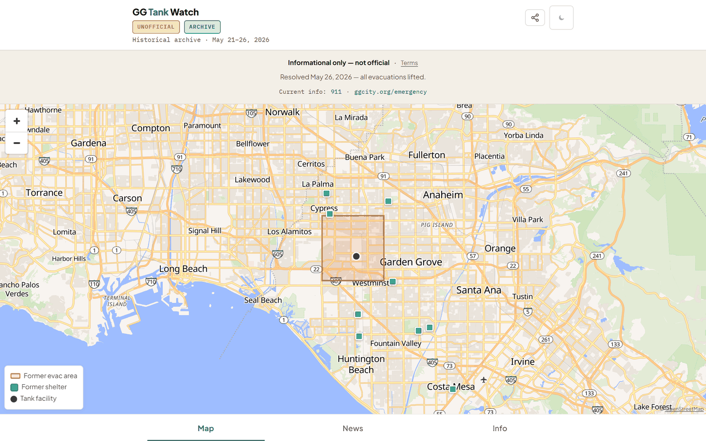
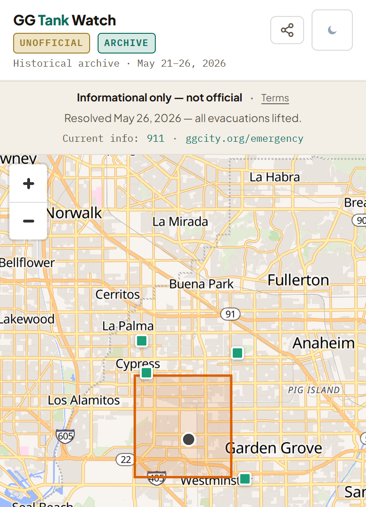
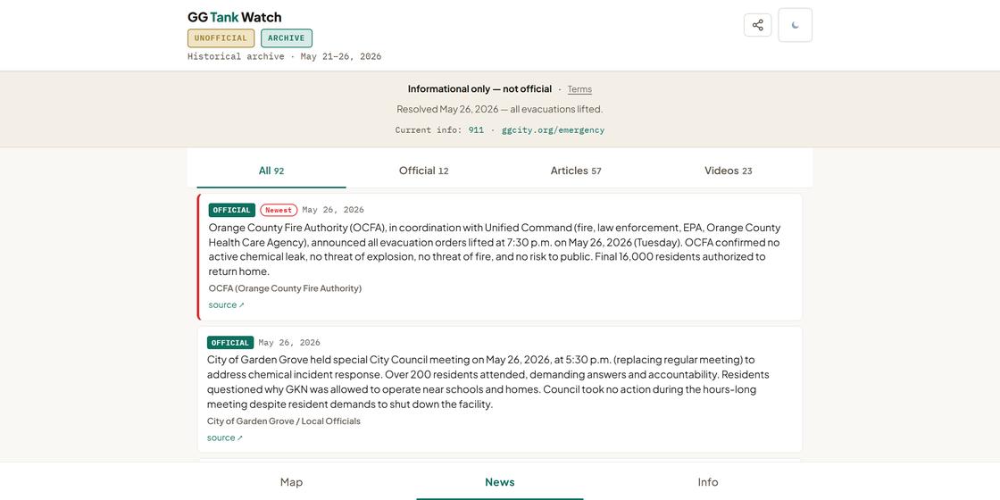
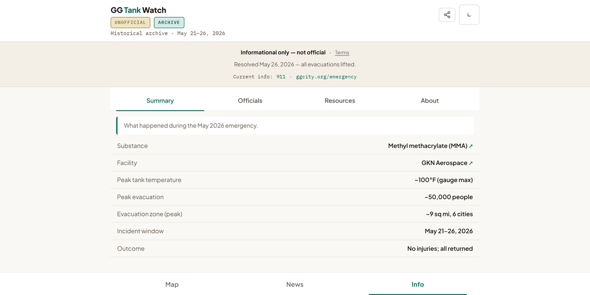
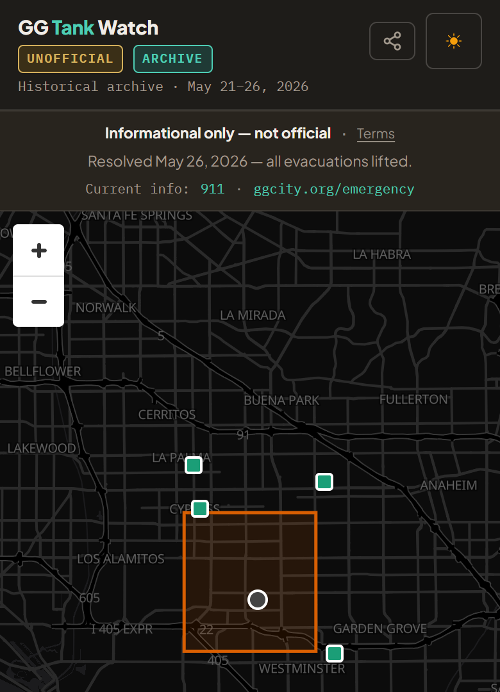

# GG Tank Watch

**A frozen historical archive of the May 21–26, 2026 Garden Grove methyl-methacrylate (MMA) chemical-tank emergency.**

- A real Orange County, California incident: ~50,000 residents evacuated from ~9 square miles across six cities.
- Built during the emergency by a local volunteer to amplify official information for evacuees.
- **No longer updated.**

[](#)
[](LICENSE)
[](#stack)
[](eval/)
[](https://ggtankwatch.org)

> **Informational only. Not official emergency guidance.** The incident resolved **May 26, 2026**. For any current emergency, call **911** and see **[ggcity.org/emergency](https://ggcity.org/emergency)**.
>
> *Independent and not affiliated with, endorsed by, or operated by the City of Garden Grove, the Orange County Fire Authority, Cal OES, the EPA, or any government agency.*

## What this demonstrates

A consumer-facing AI system that informs but never instructs. That guarantee is **code and tests, not prompting**, and it had to hold under real stakes:

- **Scalable oversight.** A suite of 211 automated tests catches safety regressions *before* they ship, not after.
  - What it catches: fabricated sources, synthesized directives, stale data stamped fresh.
- **The model never published directly.**
  - Its extracted facts reached the live page only through one validation gate (`scripts/update_status.py`) that it could not bypass.
  - The most the system could do was route people to officials.
  - Page copy (labels, summaries) was AI-assisted and human-reviewed, disclosed on the site itself.
- **The asymmetry that matters most.** A false "safe to return" message could have sent ~50,000 people back into danger. A false "still dangerous" only kept them away longer.
  - Repeating officials' "evacuation lifted" announcement took at least two sources. Repeating a new danger update took one.
  - The site never synthesized an alert level of its own.

The rest of this README explains each decision: what was built, what was deliberately *not* built, and why.

<p align="center">
  <a href="https://ggtankwatch.org"></a>
</p>

<table align="center">
  <tr>
    <td align="center" valign="top"><br><sub><b>Map</b></sub></td>
    <td align="center" valign="top"><br><sub><b>Coverage Archive</b></sub></td>
    <td align="center" valign="top"><br><sub><b>What happened</b></sub></td>
    <td align="center" valign="top"><br><sub><b>Dark mode</b></sub></td>
  </tr>
</table>

---

## What this is, in 30 seconds

GG Tank Watch is a single-page dashboard built during a multi-day chemical emergency.

- It pulled scattered updates from officials and news outlets into one calm view and **pointed back to the authorities in charge**.
- It is a **pure information conduit**: it relays what officials and newsrooms published, and issues no judgments of its own.
- The emergency is over, so the dashboard is frozen: the pipeline is retired, the page no longer checks for updates, and every tab is labeled **ARCHIVE** with the incident dates (May 21–26, 2026) so it cannot be misread as live.

Its organizing principle:

> **Responsible and helpful are the same lane.** Every safety constraint made the product *more* trustworthy and *more* useful to a worried reader, not less. The reasoning is the point, not just the code.

---

## Origin

GG Tank Watch started with one worried person. During the May 2026 emergency, Nancy had family near the evacuation zone. For days she refreshed the news on a loop, trying to tell from scattered and contradicting reports whether things were getting better or worse. So Mike built her one page that showed the official picture at a glance, honestly labeled. It became the one place she trusted. She could stop hunting for updates and get back to the people she loved.

> *"I didn't need more news. I needed to know my family was okay without reading twenty articles to figure it out."*

*Built by Mike, with Nancy as its first user and the reason it exists.*

---

## Safety architecture & verification

Every model output passes through **one validation gate** (`scripts/update_status.py`) before anything reaches the published data file (`status.json`, the file the page reads its facts from).

The gate's four highest-stakes checks, enforced in code, not prompting:

| Control | What it prevents | The rule |
|---------|------------------|----------|
| **P0-1 Corroboration gate** | A single hallucinated `evacuation_lifted: true` firing a false "safe to return" message | Repeating an official "evacuation lifted" announcement needs **at least 2 sources, at least 1 of them an official agency**. A new danger update repeats with 1 source. |
| **P0-2 Provenance check** | A fabricated source URL or unattributed quote reaching the dashboard | A statement is dropped unless its `source_url` was actually fetched in the same run that produced it. The model cannot cite a page the pipeline never visited. |
| **P0-3 Freshness honesty** | A run that found nothing new stamping a fresh timestamp on old data | Data age (`data_as_of_iso`) is tracked separately from write time, and the staleness banner is driven by data age. |
| **P1-1 Date sanity** | A future-dated or malformed `incident_resolved_iso` flipping the incident to "resolved" | Out-of-range or malformed timestamps are nulled before the file is written. |

Full diagram + per-control test mapping: [`docs/AI_CONTROL_ARCHITECTURE.md`](docs/AI_CONTROL_ARCHITECTURE.md).

### Run the tests yourself

```bash
python eval/run_all.py --skip integration
```

Expected (211 tests, all green):

```
  behavioral      203/203  (100.0% pass)
  schema            8/8    (100.0% pass)
----------------------------------------------------------------
  TOTAL           211/211  (100.0% pass)
```

**211 automated pass/fail tests across 65 files** cover:

- **The pipeline:** how the update script behaved on each run, plus the four gates in the table above.
- **The content rules:** the site never produces verdicts of its own, never tells anyone what to do, and never ships safety text in a language no one on the team could verify.
- **The frozen archive:** nothing dated after officials lifted the evacuation on May 26, the page never resumes checking for updates, the retired refresh script stays retired, and a test compares the numbers quoted in this README against the data files, so the README cannot quietly drift out of date.
- **Security:** anything copied from the web is treated as plain text, so a malicious page cannot tamper with this one, and the page may only load content from a short approved list of sources.
- **Honesty details:** link and share previews describe an archive (never a live tool), and features removed for safety stay removed (the misleading wind arrow, automatic image fetching).
- **The UI:** key layouts render correctly on phone screens, and labels stay legible.

Each run appends to [`eval/scores.jsonl`](eval/scores.jsonl), so breakage shows up in the score history. If you run the tests yourself, avoid `--quiet`: it trims the output but also hides the per-test lines that show which test failed.

*Reviewing the method in depth?*

- [`docs/safety-method/safety-method-writeup.md`](docs/safety-method/safety-method-writeup.md): the whole approach in one first-person read.
- [`docs/safety-method/evidence-summary.md`](docs/safety-method/evidence-summary.md): maps each safety principle to its tests.
- [`docs/safety-method/what-we-learned.md`](docs/safety-method/what-we-learned.md): the honest arc of the help-versus-restraint calls.
- [`gg-tank-watch-method`](https://github.com/Mike-E-Log/gg-tank-watch-method): the standalone published extract (the F1–F12 red-team, a receipted eval export, the decision-authority note).

---

## The thesis: conduit, not verdict-author

The single most load-bearing decision in the project is what it **refuses** to do.

Early builds (v0.1–v0.7) had a "check your address" tool that geocoded an address, computed a blast/plume radius, and rendered a personal verdict (`SAFE` / `ELEVATED` / `HIGH` / `CRITICAL`). On **2026-05-26** all of that was removed in the **conduit pivot**. The dashboard now states officials' facts and routes to officials' channels; it issues no directives and authors no hazard assessments.

This is both an ethics decision and a legal one. As a pure automated feed of third-party links, the project leans on **Section 230 (47 U.S.C. § 230(c)(1))** and **_Winter v. G.P. Putnam's Sons_ (9th Cir. 1991)** — publishers of information owe no duty to verify it. The moment the app authors its *own* safety verdict, it steps outside that shelter and into a voluntarily-undertaken duty of care (Restatement (Second) of Torts §§ 323, 324A). Removing the verdict made the product safer for residents *and* legally defensible. See [`docs/LEGAL.md`](docs/LEGAL.md) and [`docs/CONDUIT_PATTERN.md`](docs/CONDUIT_PATTERN.md).

---

## Safety & ethics decisions (the core)

Every decision below is logged with its rationale and, where direction changed, its reversal. Fuller per-decision records live in [`DESIGN_LOG.md`](DESIGN_LOG.md) (D-001–D-039, with rubric scores) and the `docs/` set.

### Avoiding harm — conduit, not verdict-author

| Decision | Why | Rejected alternative |
|----------|-----|----------------------|
| **No authored hazard verdicts** (removed the address checker, blast/plume layers, severity badges) | An AI-authored "you are in the danger zone" is a directive the project has no authority to issue, and it forfeits the §230 conduit shelter | Geocode → blast-radius → personal verdict (the v0.1–v0.7 design) |
| **No directives** — never "evacuate" / "shelter now" | Only officials issue evacuation orders; the app routes to them | Action-verb hero copy ("LEAVE NOW") — rejected as false authority + liability |
| **Official sources first, always** | The conduit's job is to point at the authorities, not replace them; officials lead every list and the persistent safety strip routes to them on every tab | Make the dashboard the primary reference and bury official links |
| **No PII** — aggregate data only ("~50,000 residents evacuated") | A safety tool must not expose residents | Publish shelter rosters / named testimonials |

### Honesty & AI transparency

| Decision | Why | Rejected alternative |
|----------|-----|----------------------|
| **Persistent AI-assistance disclosure** ("compiled with AI assistance, checked by people") | Residents deserve to know what produced what they're reading; the disclosure stays legible (13px), never shrunk to fine print | Hide the AI involvement; ship model output unreviewed |
| **Provenance check (P0-2)** | A fabricated citation, once committed to git, is permanent | Warn-but-keep the unverified citation |
| **Freshness honesty (P0-3)** — two timestamps + staleness banner | A run that learns nothing must not look fresh | A single timestamp for both write age and data age |
| **No false time precision** — archive items render **date-only** unless the exact publish time is verified | Search surfaces the date, rarely the minute; a resolved record never drifts to "3 months ago" | Show relative time / fabricated minute-level precision |
| **Correctable = trustworthy** — a visible error channel (ggtankwatch@gmail.com) | Being correctable is a credibility signal | No error channel; silent edits |

### Human oversight & scalable oversight

| Decision | Why | Rejected alternative |
|----------|-----|----------------------|
| **Single chokepoint control layer** (`update_status.py`) | One place where every safety-relevant field is validated before publish; the model can't write the snapshot directly | Distributed validation across gatherer + writer + frontend |
| **Asymmetric corroboration gate (P0-1)** | A false all-clear is the worst outcome; relaying an official all-clear needs ≥2 sources incl. ≥1 of 6 official-agency hosts | A symmetric gate that lets one source authorize an all-clear |
| **Severity is *derived*, never model-extracted** (internal pipeline state — never displayed to residents) | A partial-facts tick must not silently downgrade the internal severity field to "low" | Accept severity from the model / recompute on every tick |
| **Gatherer fail-closed contract** | If a gather fails, the writer writes nothing — the page goes visibly stale, never confidently wrong | Emit empty facts + exit 0 (fresh-stamps stale data) |
| **A 211-test behavioral eval gates merges** | Safety properties regress silently without a machine-checkable gate | Manual review only |

### Language access (G1)

| Decision | Why | Rejected alternative |
|----------|-----|----------------------|
| **English-only by design** — no non-English safety copy is surfaced without fluent human verification; LEP residents are routed to officials, who publish their own verified translations | The affected area overlaps Little Saigon; a *wrong* Vietnamese safety string is worse than none. A fluent verifier was never secured (the G1 gate), so the conservative resolution was to remove non-English entirely | Ship machine-translated Vietnamese / unverified native review |

This is the project's clearest case of that: the conservative call (remove rather than risk) is also the safer call. See [`docs/LANGUAGE_ACCESS.md`](docs/LANGUAGE_ACCESS.md), guarded by [`eval/test_language_access.py`](eval/test_language_access.py) and `eval/test_no_vietnamese_residue.py`.

### Responsible deployment

| Decision | Why | Status |
|----------|-----|--------|
| **`noindex` kept permanently — by choice, not as a pending gate** | Search discoverability was never a goal for a resolved-incident archive, and attorney review (originally the launch gate) was judged unnecessary once the incident resolved and the site froze | `noindex, nofollow` enforced via HTTP header (`vercel.json`) + `robots.txt: Disallow: /`; **settled** |
| **Nonprofit entity + liability insurance before wide launch** | Two private volunteers carry no statutory immunity (the Volunteer Protection Act needs a nonprofit/government nexus) | **Never needed** — no wide launch happened or is planned; the frozen archive stays direct-link only |
| **Phase-gated rollout (Phase 0–3, gates G1–G5)** | Distribution is earned, not assumed; only Phase 0 was ever executed | Uncontrolled launch |
| **No ads, no subscriptions, no tracking, no login** | Free + no commercial nexus keeps the pecuniary-interest liability shield (Restatement §552) and respects privacy | Monetize / collect analytics |

### Deliberately NOT built

The negative space is part of the design. Each "no" traces to the same rule — bounded authority, routed to officials:

- **No address checker / blast-plume maps / severity badges** — an AI-authored "you are in danger" is a directive the project has no authority to issue, and it forfeits the §230 conduit shelter (removed in the conduit pivot, 2026-05-26).
- **No evacuate / shelter directives** — only officials issue protective-action orders; the app routes to them.
- **No machine-translated safety copy** — a wrong safety string in a language we can't verify is worse than none (G1; English-only, LEP residents routed to officials).
- **No single-station wind indicator** — one NOAA station pointed the wrong way ~34% of the time, and a misread wind arrow on a no-directives tool is a hazard (removed 2026-05-31).
- **No runtime image scraping** — YouTube thumbnails derive from the canonical `hqdefault.jpg` formula, never fetched at query time, preserving provenance + human review ([`eval/test_no_runtime_scraper.py`](eval/)).
- **No third-party CDN in the critical path** — MapLibre GL is self-hosted, so the map can't vanish when a CDN changes.
- **No full-article reproduction** — headline + snippet + link + attribution only.
- **No government seals or "official" framing** — the conduit must never be mistaken for the authority it points to.

---

## How it was built — the journey, and the reversals

The interesting decisions are the ones that changed. All are logged in [`DESIGN_LOG.md`](DESIGN_LOG.md).

- **Push-first → dashboard-first (D-001 → D-009).** The first plan was mobile push notifications (you can't see a dashboard while asleep). The user reversed it — "scratch all mobile plans" — and the ntfy/push pipeline was removed cleanly. Both decisions are logged with full reasoning.
- **The conduit pivot (2026-05-26).** Removed the address checker, blast/plume layers, and severity verdicts. The single most important decision in the project (see [thesis](#the-thesis-conduit-not-verdict-author)).
- **The historical-archive pivot (live → frozen).** Once the incident resolved, live polling was pointless and a stale "live" view is a hazard. The dashboard was frozen: polling disabled, the refresh job retired (`refresh_local.py` now exits with an "ARCHIVED" error), every heading date-anchored.
- **Vietnamese safety copy → English-only (G1).** Early builds carried Vietnamese translations for the Little Saigon population near the zone. With no fluent verifier secured, a *wrong* safety string in a language we couldn't check was judged worse than none — so all non-English was removed and LEP residents routed to officials' own verified translations. The conservative call was also the safer one.
- **Info tab: 6 sub-tabs → 4 equal-width (Summary · Officials · Resources · About).** Six scrollable sub-tabs clipped their labels at 375px (caught after the fact); the fix was four equal-width tabs that fit, locked by a rendered-geometry guard ([`eval/test_info_subtab_fit.py`](eval/)).
- **Recovery-first Resources ordering.** A frozen archive serves *post*-crisis viewers, so Resources leads with **Recovery aid**, then date-anchored Evacuation shelters (May 2026), then School closures (May 2026) — recovery is the only still-forward-actionable section.
- **Name: "GG Tank Watch," not "…Safety."** "Safety" over-claims authority and risks resident over-trust (the Citizen-app precedent). "Watch" is honest about what it is.

---

## The Coverage Archive (News tab)

The News tab is a resolved-state **Coverage Archive** — a historical record of *how the incident was reported*, not a live feed. Coverage is read from [`data/news_archive.json`](data/news_archive.json): **92 items** (**57 articles**, **23 videos**, **12 official statements**) across **43 outlets**, each carrying per-item provenance (search query, fetch status, known caveats). Officials lead the list (the conduit principle), news follows; nothing after the May 26 all-clear boundary is included. [`eval/test_provenance.py`](eval/) fails the build if a statement's source URL wasn't actually fetched, and [`eval/test_readme_archive_count.py`](eval/) fails it if these counts drift from the data.

---

## The close-out audit (2026-06-04)

Before this README, the whole archive was audited end-to-end ([`docs/AUDIT_2026-06-04.md`](docs/AUDIT_2026-06-04.md)):

- **UI/UX sweep:** 108 renders (widths 320–1440 × light/dark × every surface) via Playwright — **geometry-green**, zero new issues.
- **Link liveness:** **110 / 112** runtime URLs live (1 genuine 404, since fixed; 1 rate-limited but live). A flagged `abcnews.com` concern was *refuted* by fetching the real articles.
- **Honesty fixes (the audit's point):** one news item carried a 404 URL with a *fabricated* "verified" provenance note — corrected (the one finding that contradicted the project's own thesis); `terms.html` / `accessibility.html` described removed features — trimmed to match the shipped app; the Summary outcome "0 displaced" (ambiguous next to "~50,000 evacuated") was reworded to "no permanent displacement." Each fix shipped test-first with a new guard so it can't regress.

---

## Architecture (frozen)

```
┌──────────────────────────────────────────────────────────────────────┐
│  HISTORICAL pipeline (now retired)                                     │
│  refresh job (on demand) → claude -p WebSearch (subscription)          │
│       ↓ extracts structured facts as JSON, pipes to stdin              │
│  scripts/update_status.py  (Python stdlib only) — THE CONTROL LAYER    │
│   • P0-1 corroboration · P0-2 provenance · P0-3 freshness · P1-1 dates │
│   • severity derived (not model-extracted); atomic-write status.json   │
│       ↓                                                                 │
│  status.json  ← frozen snapshot (2026-05-27T02:30:00Z all-clear)       │
│       ↑                                                                 │
│  dashboard.html  (vanilla JS, no build step) — THE READER             │
│   • Map (MapLibre GL + OpenFreeMap) · News (Coverage Archive) · Info   │
│   • polling DISABLED (frozen); service-worker caches the shell + map   │
└──────────────────────────────────────────────────────────────────────┘
```

**No backend, no database, no auth, no build step.** Two files of real code (a Python writer + an HTML/JS reader), JSON as the message bus, the browser as the runtime. The historical data pipeline was updated every ~30 minutes during the active incident, and each fact was cross-referenced against multiple sources before publishing; it is now frozen. Self-hosting MapLibre GL is a deliberate reliability choice — an earlier CDN-loaded build vanished on refresh, so the library now ships with the app and is service-worker cached. See [`docs/DATA_SYNC.md`](docs/DATA_SYNC.md) for the dual-path (subscription-CLI vs. metered-SDK) sync design and its cost tradeoff.

---

## Stack

- **Frontend:** vanilla HTML/CSS/JS in a single **~112 KB** `dashboard.html` (no framework, no build step) + [MapLibre GL](https://maplibre.org/) self-hosted in `/lib` (~852 KB) + [OpenFreeMap](https://openfreemap.org/) vector tiles (light/dark). A service worker (cache `gg-tank-v84`) caches the shell + map for offline resilience.
- **Writer:** Python 3 **stdlib only**, no external dependencies.
- **Security headers (prod, `vercel.json`):** strong CSP (`default-src 'self'`), `X-Frame-Options: DENY`, `X-Robots-Tag: noindex, nofollow`.
- **Eval:** pytest-style harness, **211 tests across 65 files** + LLM-as-judge rubrics ([`eval/rubrics/`](eval/rubrics/)).
- **Hosting:** Vercel static (auto-deploys `main`).

---

## The incident (facts, as archived)

| | |
|---|---|
| **Substance** | Methyl methacrylate (MMA), a ~34,000-gallon tank |
| **Facility** | GKN Aerospace, 12122 Western Ave, Garden Grove, CA |
| **Peak tank temperature** | ~100°F (exceeded the gauge maximum) |
| **Peak evacuation** | ~50,000 people |
| **Evacuation zone** | ~9 sq mi across 6 cities (Garden Grove, Anaheim, Buena Park, Cypress, Stanton, Westminster) |
| **Window** | May 21–26, 2026 |
| **Outcome** | No injuries; all evacuees returned |

---

## Running it yourself

**View it live:** **[ggtankwatch.org](https://ggtankwatch.org)** — the frozen archive, hosted. It is intentionally `noindex` (not listed in search engines); the direct link works.

To run it locally instead — see [`USAGE.md`](USAGE.md). The dashboard is a static file — serve the repo root and open `dashboard.html`:

```powershell
git clone <this-repo>
cd gg-tank-watch
python -m http.server 8000   # then open http://127.0.0.1:8000/dashboard.html
python eval/run_all.py --skip integration   # 211 tests, exits 0
```

The data pipeline is frozen; `scripts/refresh_local.py` is retired by design and exits with an "ARCHIVED" error.

---

## Repository layout

```
gg-tank-watch/
├── README.md                  ← you are here
├── CLAUDE.md                  ← binding safety-principles table (project instructions)
├── dashboard.html             ← the dashboard (single file)
├── terms.html · accessibility.html
├── config.json · status.json · timeline.json
├── data/news_archive.json     ← the Coverage Archive (92 items, per-item provenance)
├── sw.js · manifest.json      ← PWA / offline
├── DESIGN_LOG.md · DESIGN.md · CHANGELOG.md · USAGE.md
├── scripts/
│   ├── update_status.py        ← the writer (the control layer)
│   ├── gather_facts.py         ← metered-SDK gatherer (cloud path)
│   └── refresh_local.py        ← subscription refresh (retired/archived)
├── docs/
│   ├── AI_CONTROL_ARCHITECTURE.md   ← control layer + test mapping
│   ├── FAILURE_ANALYSIS.md          ← red-team failure modes
│   ├── CONDUIT_PATTERN.md · LEGAL.md · CODE_OF_CONDUCT.md
│   ├── LANGUAGE_ACCESS.md · DATA_SYNC.md · DATA_QUALITY.md
│   ├── SPEC.md · WCAG_NOTES.md
│   └── AUDIT_2026-06-04.md          ← the close-out audit
└── eval/
    ├── run_all.py              ← runs everything, appends scores.jsonl
    ├── test_*.py               ← 65 test files / 211 tests
    └── rubrics/                ← LLM-as-judge prompts
```

---

## License

MIT — see [`LICENSE`](LICENSE).
