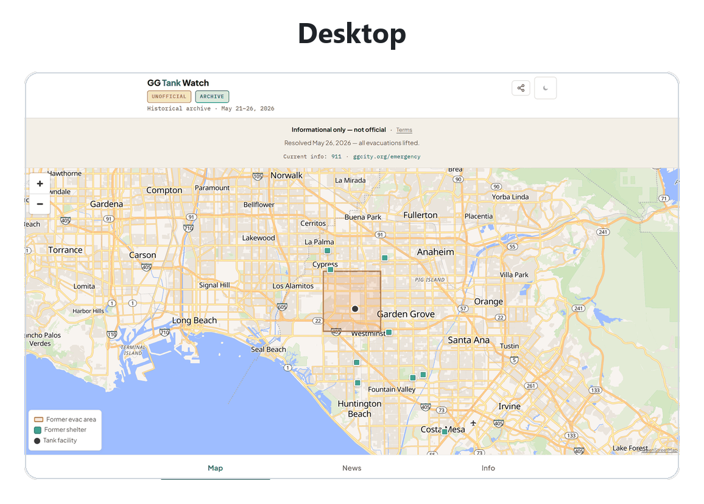
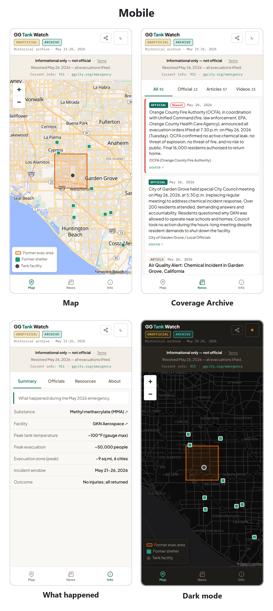

# GG Tank Watch

**A frozen historical archive of the May 21–26, 2026 Garden Grove methyl-methacrylate (MMA) chemical-tank emergency.**

- A real Orange County, California incident: ~50,000 residents evacuated from ~9 square miles across six cities.
- Built during the emergency by a local volunteer to amplify official information for evacuees.
- **An AI collected candidate facts — code decided what got published.** Every fact the AI brought back passed one checkpoint program first — for example, "evacuation lifted" could not publish until two sources, one of them official, agreed. Automated tests still guard the site's rules — first among them: inform, never instruct.


[](LICENSE)
[](#stack)
[](eval/)
[](https://github.com/Mike-E-Log/gg-tank-watch/actions/workflows/eval.yml)
[](https://ggtankwatch.org)

> **Informational only. Not official emergency guidance.** The incident resolved **May 26, 2026**. For any current emergency, call **911** and see **[ggcity.org/emergency](https://ggcity.org/emergency)**.
>
> *Independent and not affiliated with, endorsed by, or operated by the City of Garden Grove, the Orange County Fire Authority, Cal OES, the EPA, or any government agency.*

<p align="center">
  <a href="https://ggtankwatch.org"></a>
</p>

<p align="center">
  <a href="https://ggtankwatch.org"></a>
</p>

<p align="center">
  <sub>Built by <a href="https://github.com/Mike-E-Log"><b>Mike Ilog</b></a> · AI Engineer · LLM &amp; agent evaluation &nbsp;·&nbsp; <a href="https://www.linkedin.com/in/mikeilog/">LinkedIn</a></sub>
</p>

## What this demonstrates

A consumer-facing AI system that informs but never instructs — a guarantee held by **code and tests, not prompting**, under real stakes. The organizing principle:

> **Responsible and helpful are the same lane.** Every safety constraint made the product *more* trustworthy and *more* useful to a worried reader, not less. The reasoning is the point, not just the code.

It maps to Anthropic's "helpful, honest, harmless" standard:

| Anthropic's standard | How this project held it |
|---|---|
| **Helpful** | The official picture, one calm page, at a glance. |
| **Honest** | AI's role disclosed on the page. Every source real. |
| **Harmless** | Informs, never instructs. Routes people to officials. |

What holds it up:

- **Scalable oversight.** A suite of automated tests catches safety regressions *before* they ship: fabricated sources, synthesized directives, stale data stamped fresh.
- **The model collected; it never published.** Its candidate facts reached the live page only through one validation gate (`scripts/update_status.py`) it could not bypass; page copy was AI-assisted, human-reviewed, and disclosed on the site itself.
- **The asymmetry that matters most.** A false "safe to return" could have sent ~50,000 people back into danger — so repeating "evacuation lifted" took at least two sources, a new danger update took one, and the site never synthesized an alert level of its own.


---

## The whole system, at a glance

```text
Claude + web search — COLLECTED candidate facts, every ~20-30 min (May 2026)
  ↓
update_status.py — THE GATE — code that CHECKED every candidate fact
  corroboration · provenance · freshness · dates
  danger level set in code, never by the model
  ↓
status.json — only the facts that passed
  ↓
dashboard.html — relays officials, never instructs
  ↓
May 26: resolved → frozen archive, guarded by tests
```


---

## Origin & how it was built

GG Tank Watch started with one worried person. During the May 2026 emergency, Nancy had family near the evacuation zone. For days she refreshed the news on a loop, trying to tell from scattered and contradicting reports whether things were getting better or worse. So Mike built her one page that showed the official picture at a glance, honestly labeled. It became the one place she trusted. She could stop hunting for updates and get back to the people she loved.

> *"I didn't need more news. I needed to know my family was okay without reading twenty articles to figure it out."*

### The build journey, and the reversals

The decisions worth showing are the ones that changed; the full record is in [`DESIGN_LOG.md`](docs/archive/DESIGN_LOG.md).

| Date | What changed | Type |
|------|--------------|------|
| May&nbsp;24 | Push alerts planned, then reversed within 90 minutes to one dashboard | Reversal |
| May&nbsp;24 | Blast radius, chemical plume, and the evacuation zone added to the map, on request | Addition |
| **May&nbsp;26** | **The conduit pivot: address checker, blast and plume layers, and all safety verdicts removed; evacuation zone kept** | **Reversal** |
| May&nbsp;26 | Officials lift the evacuation; the incident is resolved | Milestone |
| May&nbsp;27 | Map bundled into the app after a hosted map vanished on reload | Fix |
| May&nbsp;30 | Vietnamese safety text removed; the site goes English-only | Removal |
| May&nbsp;31 | Single-station wind arrow removed | Removal |
| Jun&nbsp;1 | Live dashboard frozen into an archive | Milestone |

The removals share one rule: cut anything the project could not fully stand behind, even when that meant the site could do less — the **conduit pivot** (the bold row) is the clearest case (see [the thesis](#the-thesis-a-conduit-not-a-judge)). Even the name stayed **"GG Tank Watch," not "…Safety"**: a "safety" label would claim more authority than a volunteer archive actually has.

### The incident, as archived

| Fact | Detail |
|------|--------|
| **Substance** | Methyl methacrylate (MMA): about 7,000 gallons, inside a 34,000-gallon tank |
| **Facility** | GKN Aerospace, 12122 Western Ave, Garden Grove, CA |
| **Peak tank temperature** | At least 100°F (it maxed out the gauge, which could not read higher) |
| **Peak evacuation** | ~50,000 people |
| **Evacuation zone** | ~9 sq mi across 6 cities (Garden Grove, Anaheim, Buena Park, Cypress, Stanton, Westminster) |
| **Window** | May 21–26, 2026 |
| **Outcome** | No injuries; all evacuees returned |


---

## Safety architecture & verification

The model's job ended at collection — publishing was the gate's call. Every candidate fact passed through **one validation gate** (`scripts/update_status.py`) before anything reached `status.json`, the published data file. The four highest-stakes checks, enforced in code, not prompting:

| Control | The rule |
|---------|----------|
| **Corroboration** | "Evacuation lifted" repeated only with **at least 2 sources, 1 of them official**; a new danger repeated with 1 — a single made-up value could not fire a false "safe to return" |
| **Provenance** | A statement was dropped unless its source URL had actually been fetched in the run that produced it — no citing pages the pipeline never visited |
| **Freshness honesty** | Data age was tracked separately from write time — a run that found nothing new could not stamp old data as fresh |
| **Date sanity** | Out-of-range or malformed timestamps were nulled — a bad date could not flip the incident to "resolved" |

Full diagram + per-control test mapping: [`docs/AI_CONTROL_ARCHITECTURE.md`](docs/AI_CONTROL_ARCHITECTURE.md).

### Run the tests yourself

```bash
python eval/run_all.py --skip integration
```

Expected (213 tests, all green):

```
  behavioral      205/205  (100.0% pass)
  schema            8/8    (100.0% pass)
----------------------------------------------------------------
  TOTAL           213/213  (100.0% pass)
```

(The full census is **215**: the 2 extra tests are live geocoder regressions that call a network service, so they stay opt-in — drop `--skip integration` to run them.)

**Automated pass/fail tests** guard the pipeline gates above, the content rules (no verdicts, no directives, no safety text in a language no one on the team could verify), and the frozen archive: nothing dated after the May 26 all-clear, and the numbers quoted in this README are checked against the data files, so this page cannot quietly drift. They also cover security (anything copied from the web is treated as plain text) and the phone-screen UI. Each run appends to [`eval/scores.jsonl`](eval/scores.jsonl), so breakage shows up in the score history.

*Going deeper:*

- [`docs/safety-method/safety-method-writeup.md`](docs/safety-method/safety-method-writeup.md): the controls, the eval harness, and its blind spots, in one first-person read.
- [`docs/safety-method/evidence-summary.md`](docs/safety-method/evidence-summary.md): every safety principle mapped to its tests.
- [`docs/safety-method/what-we-learned.md`](docs/safety-method/what-we-learned.md): the honest arc of the help-versus-restraint calls.
- Sealed method extract from the archived [`gg-tank-watch-method`](https://github.com/Mike-E-Log/gg-tank-watch-method) mirror: failure-mode analysis ([docs/failure-analysis.md](docs/failure-analysis.md)), decision-authority note ([docs/decision-authority.md](docs/decision-authority.md)), and a test-results export ([docs/eval-summary.json](docs/eval-summary.json)) sealed at `d34093c` — **210/210** (the export omits its own meta-test; the live suite has since grown).


---

**Audited before freezing.** The whole archive was checked end to end on 2026-06-04 ([the audit record](docs/archive/AUDIT_2026-06-04.md)): its sharpest finding contradicted the project's own thesis — one item paired a dead link with a fabricated “verified” note — and was corrected with a new test so it cannot come back; 108 layout screenshots were checked the same day, and a link sweep found 110 of 112 page links live. A later review ([2026-07-21](docs/archive/AUDIT_2026-07-21_FABLE5.md)) re-checked the repo’s presentation.

---

## The thesis: a conduit, not a judge

The most important decision in this project is what it **refuses** to do.

Early builds (v0.1–v0.7) had a "check your address" tool: type an address, get a personal verdict. On **May 26, 2026** it was removed — the **conduit pivot**. Since then the dashboard repeats officials' facts, routes people to officials' channels, and never makes a safety judgment of its own.

That refusal is ethics and law at once:

- **Ethics.** A volunteer dashboard has no authority to tell a family whether their street is safe. Officials do — so it points at them.
- **Law.** A site that only relays what others published is sheltered by **Section 230** (47 U.S.C. § 230(c)(1): a relay is not the speaker) and ***Winter v. G.P. Putnam's Sons*** (9th Cir. 1991: publishers owe no duty to verify). This is the project's own reading — no attorney reviewed it.
- **The line it must not cross.** The moment the app writes its *own* safety verdict it leaves that shelter: it has volunteered safety advice — and owes a duty of reasonable care (Restatement (Second) of Torts §§ 323, 324A).

Removing the verdicts made the product safer *and* legally defensible. Full analysis: [`docs/LEGAL.md`](docs/LEGAL.md) · [`docs/CONDUIT_PATTERN.md`](docs/CONDUIT_PATTERN.md).


---

## Safety & ethics decisions (the core)

Six decisions carry the project. Each gave something up. The complete record — 39 numbered decisions, each with its reasoning, a rubric score, and any reversal — lives in [`DESIGN_LOG.md`](docs/archive/DESIGN_LOG.md).

| Decision | What it bought the reader | Evidence |
|----------|---------------------------|----------|
| **No verdicts of its own.** The address checker and its SAFE/ELEVATED/HIGH/CRITICAL calls were removed — the conduit pivot | Safety calls only from people with the authority to make them, on a site that keeps its legal shelter ([the thesis](#the-thesis-a-conduit-not-a-judge)) | [`docs/LEGAL.md`](docs/LEGAL.md) · [`eval/test_safety.py`](eval/test_safety.py) |
| **No directives.** Never "evacuate" / "shelter now"; officials lead every list, and the safety strip on every tab routes to them | One calm page that points at the authorities instead of replacing them | [`docs/CONDUIT_PATTERN.md`](docs/CONDUIT_PATTERN.md) |
| **AI involvement disclosed on the page.** The About tab closes with: "Summaries in this archive are compiled with AI assistance from official and news sources, then checked by people." — legible (13px), never fine print | The reader knows what produced what they're reading | [Live site](https://ggtankwatch.org) → Info → About · [`eval/test_info_archive_clarity.py`](eval/test_info_archive_clarity.py) |
| **Stricter proof for good news than for bad.** Repeating "evacuation lifted" took two sources; a new danger took one. And if gathering failed, nothing was published | A false "safe to return" — the worst outcome for ~50,000 evacuees — was the hardest message to publish; the page went visibly stale, never confidently wrong | [`docs/AI_CONTROL_ARCHITECTURE.md`](docs/AI_CONTROL_ARCHITECTURE.md) |
| **English-only by design.** No safety text in a language no one on the team could verify; residents with limited English are routed to officials, who publish their own verified translations | The affected area overlaps Little Saigon — a *wrong* Vietnamese safety message is worse than none | [`docs/LANGUAGE_ACCESS.md`](docs/LANGUAGE_ACCESS.md) · [`eval/test_language_access.py`](eval/test_language_access.py) |
| **Nothing asked of the reader.** No ads, subscriptions, tracking, or login; `noindex` kept permanently; aggregate numbers only, never personal information | A free page with no stake in its readers' attention or data — and no exposure of the people it served | [`docs/LEGAL.md`](docs/LEGAL.md) · [`public/vercel.json`](public/vercel.json) |

What was *not* built is design too: no single-station wind arrow, no scraped images, no full-article copies, no government-seal styling — and the map *library* ships with the site (only OpenFreeMap tiles and Google Fonts load from outside; the page still loads if either is unreachable). Each follows the same rule: **no authority of its own — route to officials.**


---

## The Coverage Archive (News tab)

The News tab is a **Coverage Archive**: a record of *how the incident was reported*, not a live feed.

It is read from [`public/data/news_archive.json`](public/data/news_archive.json), which holds **92 items across 42 outlets**:

- **57 articles**
- **23 videos**
- **12 official statements**

Each item carries its own provenance: the search that found it, whether the link was fetched, and any known caveats. Officials lead the list and news follows, the same conduit principle as the rest of the site. Nothing published after officials lifted the evacuation on May 26 is included.

Two tests keep this honest: [`eval/test_provenance.py`](eval/test_provenance.py) fails the build if an item's source link was never actually fetched, and [`eval/test_readme_archive_count.py`](eval/test_readme_archive_count.py) fails it if the counts above drift from the data file.


---

## Architecture & stack (the retired pipeline)

The pipeline's flow is [the flow above](#the-whole-system-at-a-glance); `status.json` was last updated May 26, when officials lifted the evacuation, and the dashboard still opens offline.

**No backend, no database, no logins, no build step.** Two parts — a Python writer and an HTML/JavaScript page — passing plain JSON files; the reader runs entirely in the browser, no server to keep alive. The data was updated every ~20-30 minutes during the incident, with reassuring news cross-referenced against multiple sources before it published; the pipeline is now frozen. See [`docs/archive/DATA_SYNC.md`](docs/archive/DATA_SYNC.md) for the two sync paths.


### Stack

- **Frontend:** plain HTML, CSS, and JavaScript — no framework; one **~116 KB** `dashboard.html`. Map: [MapLibre GL](https://maplibre.org/) self-hosted in `/lib` (**~870 KB**) with [OpenFreeMap](https://openfreemap.org/) vector tiles; a service worker saves the shell and map locally, so the page still opens offline.
- **Writer:** Python 3 **standard library only**, no outside dependencies.
- **Security headers** (production, `vercel.json`): a Content Security Policy limiting the browser to the site's own resources (`default-src 'self'`); `X-Frame-Options: DENY`; `X-Robots-Tag: noindex, nofollow`.
- **Eval:** an automated pass/fail suite ([expected output](#run-the-tests-yourself)), plus rubric prompts for the subjective checks ([`eval/rubrics/`](eval/rubrics/)).
- **Hosting:** Vercel static (auto-deploys `main`).


---

## See it live, run it locally

**View it live:** **[ggtankwatch.org](https://ggtankwatch.org)** — the hosted, frozen archive; intentionally `noindex` (not listed in search engines), but the direct link works.

**Run it locally** ([`USAGE.md`](docs/archive/USAGE.md)): the dashboard is a single static file — serve the `public/` folder and open `dashboard.html`.

```powershell
git clone <this-repo>
cd gg-tank-watch
python -m http.server 8000 -d public   # then open http://127.0.0.1:8000/dashboard.html
```

The data pipeline is frozen; `scripts/refresh_local.py` is retired by design and exits with an "ARCHIVED" error.

### Repository layout

```
gg-tank-watch/
├── README.md · CLAUDE.md · LICENSE · NOTICE
├── public/                      ← the served web root (Vercel serves this at /)
│   ├── dashboard.html            ← the dashboard (single file)
│   ├── terms.html · accessibility.html
│   ├── config.json · status.json
│   ├── data/news_archive.json    ← the Coverage Archive (92 items, per-item provenance)
│   ├── sw.js · manifest.json     ← offline support
│   ├── robots.txt · og-image.png
│   ├── vercel.json               ← deploy config (noindex, CSP, / → dashboard rewrite)
│   └── lib/                       ← bundled MapLibre GL (no third-party server in the map path)
├── data/                        ← source data: timeline.json, news seed + audit
├── docs/                        ← project docs (CHANGELOG.md, safety-method/, + archive/ for design logs, audits, spec)
├── scripts/                     ← update_status.py (validation gate), gather_facts.py, start_dashboard.bat
└── eval/                        ← run_all.py · test_*.py · rubrics/
```


---

## License

Released under the MIT license (see [`LICENSE`](LICENSE)). The safety disclaimer lives in [`NOTICE`](NOTICE).
