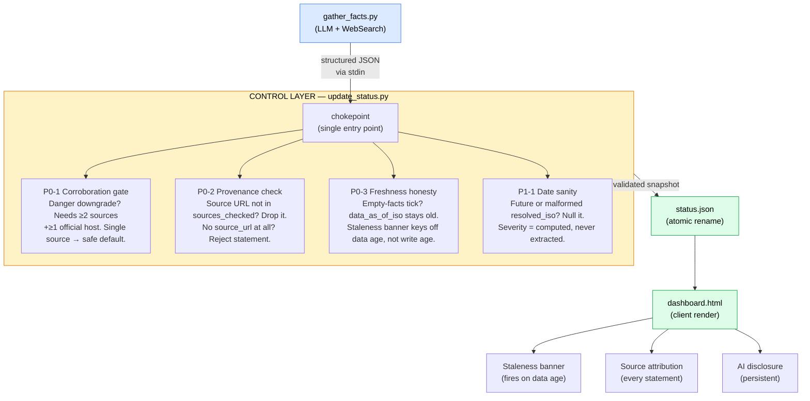

# AI Control Architecture

How GG Tank Watch ensures model outputs cannot break user safety.

## Control flow at a glance



**Asymmetric gating principle:** danger upgrades fire on 1 source (over-warning is acceptable); danger downgrades require ≥2 sources including ≥1 official host (under-warning is catastrophic). The LLM cannot write `status.json` directly — all output passes through the chokepoint.

## The problem

An LLM summarizes live news sources every 30 minutes and writes structured data to a dashboard serving ~50,000 evacuated residents during a chemical tank emergency. If the model hallucinates an "all-clear," a sheltering family might stop evacuating. If it fabricates a source, the dashboard's credibility collapses. If it timestamps stale data as fresh, the staleness banner never fires and users trust outdated information.

The governing principle: **a wrong "you're safe" is far more harmful than a wrong "still dangerous."** The pipeline must fail visibly stale, never confidently wrong.

## Architecture

```
gather_facts.py          update_status.py            dashboard.html
(LLM + web search)  →   (validator + writer)    →   (client render)
                         ┌─────────────────────┐
                         │  CONTROL LAYER       │
                         │                      │
                         │  P0-1 Corroboration  │ ← danger downgrades need ≥2 sources
                         │  P0-2 Provenance     │ ← fabricated URLs dropped
                         │  P0-3 Freshness      │ ← empty facts can't fake currency
                         │  P1-1 Date sanity    │ ← future/malformed dates nulled
                         │  Severity derivation  │ ← computed, never trusted from LLM
                         └─────────────────────┘
```

The LLM's output enters through a single chokepoint (`update_status.py`), where every safety-relevant field passes through validation before reaching the snapshot. The model cannot write directly to `status.json`.

## Three failure modes that could kill someone

From the 12-mode failure map in `docs/DATA_QUALITY.md`, three are catastrophic:

### F1: Fabricated all-clear

**What breaks:** The model asserts `evacuation_lifted: true` or `incident_resolved_iso` with no basis. Severity drops to `low`. An URGENT "INCIDENT RESOLVED" banner fires. A sheltering resident reads "all clear" and stops evacuating.

**Control: P0-1 Corroboration Gate** (`update_status.py:apply_corroboration_gate`)

Danger downgrades require ≥2 independent sources, at least one from an official agency host (`ocfa.org`, `ggcity.org`, `epa.gov`, etc.). If the threshold isn't met, the field is forced back to its safe default:

- `evacuation_lifted: true` → forced to `false`
- `incident_resolved_iso: "2026-..."` → forced to `null`

Danger upgrades (injuries, expansion, new statements) fire immediately on one source. The asymmetry is intentional: over-warning is acceptable, under-warning is not.

**Tests that catch it:**
- `test_lifted_requires_corroboration` — single source cannot authorize `lifted=true`
- `test_resolved_requires_two_sources` — single source suppresses resolution; 2+ sources honor it

### F2: Fabricated provenance

**What breaks:** The model invents a source URL or attributes a quote to an agency that never said it. The dashboard cites a non-existent OCFA statement. Users trust a fabricated quote.

**Control: P0-2 Source/URL Integrity** (`update_status.py:validate_provenance`)

Every statement's `source_url` is checked against the set of URLs actually retrieved this run (`sources_checked`). A statement citing a URL not present in `sources_checked` is silently dropped — never published. Statements with no `source_url` at all are rejected.

**Tests that catch it:**
- `test_fabricated_source_url_not_in_snapshot` — fabricated URL dropped
- `test_statement_without_source_url_rejected` — unsourced statement rejected
- `test_sources_checked_all_wellformed` — malformed URLs filtered

### F4: Stale-but-fresh-stamped

**What breaks:** The gatherer returns valid-but-empty JSON (exit 0). The writer stamps `last_updated_iso = now` on old data. The staleness banner never fires. Users believe data is current when no new fact was confirmed for hours.

**Control: P0-3 Freshness Honesty** (`update_status.py:build_snapshot`)

Two distinct timestamps:
- `last_updated_iso` — when we wrote the file (heartbeat)
- `data_as_of_iso` — when we actually learned something new

`data_as_of_iso` advances only when the current tick provides source-backed facts. An empty-facts tick inherits the previous `data_as_of_iso`. `stale_after_iso` is computed from `data_as_of_iso`, not `last_updated_iso` — so the staleness banner fires based on data age, not write age.

**Tests that catch it:**
- `test_empty_facts_do_not_advance_data_as_of` — empty tick preserves data age
- `test_all_null_facts_treated_as_no_data` — all-null facts don't fake currency
- `test_stale_after_is_data_as_of_plus_maxage` — banner keys off data, not write

## Additional controls

### Date sanity (P1-1, targets F11)

A hallucinated or mis-parsed resolution timestamp (e.g., "2099-01-01") can never flip the incident to resolved. Future-dated and malformed timestamps are nulled before they reach the snapshot.

- `test_future_resolved_iso_suppressed`
- `test_malformed_resolved_iso_suppressed`
- `test_valid_resolved_iso_honored` (no over-suppression)

### Severity derivation (targets F3, F5)

Severity is **computed, not extracted** from the model. The writer derives it from structured fields (`residents`, `lifted`, `resolved_iso`, `injuries`). A partial-facts tick that only updates `videos` does not recompute severity — it carries the previous value forward. This prevents a missing field from silently downgrading the dashboard to "low."

- `test_partial_facts_dont_downgrade_severity`

### Gatherer failure contract (targets F6, F9)

If the gatherer fails (no API key, network error, model refusal), it exits non-zero and prints nothing to stdout. The writer step is skipped entirely. `status.json` is not touched. The staleness banner fires on schedule. The pipeline fails visibly stale, never confidently wrong.

- `test_graceful_failure_no_api_key` — exit non-zero, empty stdout

### UTF-8 integrity (targets encoding drift)

On Windows, `sys.stdin.read()` uses the locale's encoding (cp1252), which corrupts em-dashes and degree signs. The gatherer explicitly decodes `sys.stdin.buffer` as UTF-8. A client-side `fixMojibake` function acts as a backstop.

- `test_em_dash_survives_non_utf8_locale`
- `test_degree_sign_survives_non_utf8_locale`

## The principle: asymmetric gating

The central design principle is **asymmetric trust**:

| Direction | Gate | Rationale |
|-----------|------|-----------|
| Danger upgrade (injuries, expansion, new statement) | Fires on 1 source | Over-warning is acceptable |
| Danger downgrade (lifted, resolved, severity drop) | Requires ≥2 sources, ≥1 official | Under-warning is catastrophic |
| Data freshness | Advances only on source-backed facts | Stale-but-fresh is worse than visibly stale |
| Provenance | Dropped unless URL was actually retrieved | A fabricated source is worse than a missing one |

This mirrors Anthropic's own approach to AI control: the system's authority is bounded by design, not by instruction. The corroboration gate doesn't ask the model to be careful — it structurally prevents a single hallucinated boolean from reaching users.

## Test coverage summary

| Control | Tests | What they verify |
|---------|-------|-----------------|
| P0-1 Corroboration | 2 | Single-source downgrade suppressed; multi-source honored |
| P0-2 Provenance | 3 | Fabricated URLs dropped; unsourced statements rejected; URL well-formedness |
| P0-3 Freshness | 3 | Empty facts don't advance data age; staleness keys off data, not write |
| P1-1 Date sanity | 3 | Future/malformed dates nulled; valid dates honored |
| Severity derivation | 1 | Partial facts don't recompute severity |
| Gatherer failure | 1 | Non-zero exit + empty stdout on failure |
| Encoding | 2 | UTF-8 survives cp1252 locale |
| **Total control tests** | **15** | |

The remaining ~193 tests in the 211-test suite cover schema validation, writer state-machine behavior (5-state sequence), safety-checker math (haversine, polygon), UI rendering contracts, encoding integrity, deployment-asset verification, and frozen-archive invariants.

## Why this matters

This is not an academic exercise. During the Garden Grove tank emergency, ~50,000 real people were evacuated. A volunteer-built dashboard using an LLM to summarize news has a specific failure mode that matters: the model confidently saying "it's safe" when it isn't.

The architecture ensures that even if the model hallucinates — which it will, eventually — the hallucination cannot reach users in a form that looks like an official all-clear. The dashboard might go stale. It might show fewer statements than it should. It will never tell someone it's safe to go home when it isn't.

That is the alignment tax never materializing: the safety constraints made the product more trustworthy, not less useful.
